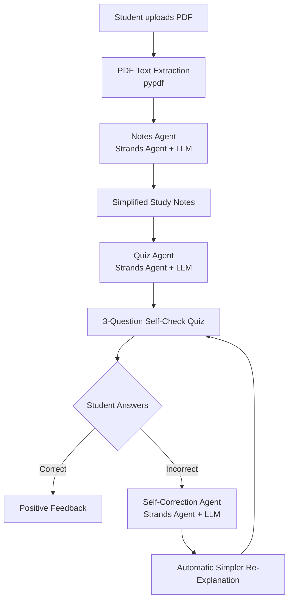

# 📚 StudyMate AI — A Self-Correcting Study Notes Agent

**Agents for Humans Hackathon — Everyday Agents Track**

StudyMate AI is an agent that turns dense course PDFs into simple, exam-ready notes — and unlike a plain summarizer, it notices when you're confused and automatically rewrites its own explanation in simpler language, without being asked.

## The Problem

Students get handed dense PDFs and slide decks by professors and are expected to turn them into study notes by hand. It's slow, repetitive, and the sheer page count is often enough to make students put off studying altogether. This is a problem the builder experienced directly as a student.

## Who It's For

Any student who has to convert professor-provided PDFs, PPTs, or reference material into notes they can actually study from — regardless of university, course, or exam format.

## Why It Matters

Turning dense material into simple notes is exactly the kind of repetitive, judgment-heavy busywork that eats hours every week. StudyMate AI doesn't just summarize once — it makes an autonomous decision to try again, differently, when its first explanation didn't land, the same way a good tutor would.

## How It Works

1. **Upload** — the student uploads a course PDF once.
2. **Autonomous batch notes generation** — the agent works through the entire document, chunk by chunk, producing simplified, structured notes for every section, without being asked file-by-file.
3. **Self-check quiz** — a short quiz is generated from the same material to test understanding.
4. **Self-correcting loop (the core agent behavior)** — when the student answers a quiz question incorrectly, the agent automatically detects this and regenerates that concept's notes in even simpler language, with an analogy, before the student asks for it again. This closes the loop autonomously rather than leaving the student to notice they're stuck and ask for help.

## Architecture



**Agent framework:** [Strands Agents SDK](https://strandsagents.com)
**Model:** Runs locally via Ollama (`llama3.2`) for the hackathon demo — swappable to Claude on Amazon Bedrock by changing one line (`BedrockModel` instead of `OllamaModel`), enabling cloud deployment without any other code changes.
**Interface:** Streamlit
**PDF parsing:** `pypdf`

## Tech Stack

- Python 3.x
- [Strands Agents SDK](https://strandsagents.com)
- Ollama (local LLM runtime) running `llama3.2`
- Streamlit
- pypdf

## Setup Instructions

### 1. Clone the repo
```bash
git clone https://github.com/mahekkshah/StudyMate-AI.git
cd StudyMate-AI
```

### 2. Create a virtual environment and install dependencies
```bash
python -m venv .venv
# Windows
.venv\Scripts\activate
# Mac/Linux
source .venv/bin/activate

pip install streamlit pypdf strands-agents
```

### 3. Install and run Ollama
Download Ollama from [ollama.com](https://ollama.com), then pull the model used by this project:
```bash
ollama pull llama3.2
```
Make sure Ollama is running in the background before starting the app.

### 4. Run the app
```bash
streamlit run app.py
```
The app will open automatically at `http://localhost:8501`.

## Future Improvements

- Spaced-repetition scheduling so topics are re-quizzed over time, not just once
- Support for multiple PDFs per subject, organized against a class timetable
- Deployment on Amazon Bedrock AgentCore for a hosted, always-available version
- MCQ-focused mode for universities with frequent multiple-choice testing, alongside a written short-answer mode for paper-exam formats

## License

MIT — see [LICENSE](./LICENSE).
